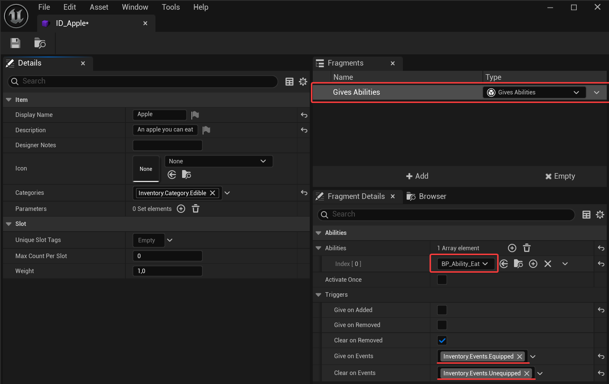
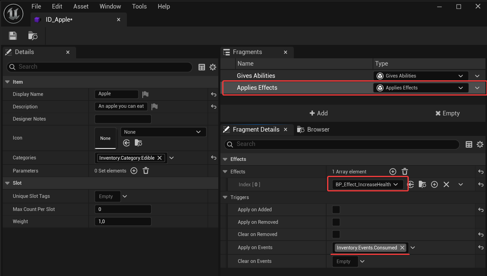

[Gameplay Ability System](https://dev.epicgames.com/documentation/unreal-engine/gameplay-ability-system-for-unreal-engine) or GAS is a plugin provided by Epic Games.

While **Inventory Extension** does not directly depend on GAS to keep it lightweight and portable, we understand its common for inventories to interact with GAS in projects that use it.

That's why, while every game is different, Inventory Extension provides a set of basic, frequent features you may find useful. This plugin is highly customizable, so don't fear grabbing what this integration provides and modifying it to fit your needs.
## Usage
### Installing the integration plugin
This integration is an small, additional plugin available inside the **"Extras"** folder of the Inventory Extension plugin.

To install it:
- Go to the path of your **InventoryExtension** plugin, then "**Extras**".
- Copy **InventoryExtensionGAS** folder into your plugins folder.
- **You are done**, simply restart/open the editor. You may need to enable the plugin in the editor.

### Granting and Clearing Abilities from Items
You can grant (and clear) abilities using the **Gives Abilities** fragment:

### Apply and Remove Gameplay Effects from Items
You can apply and remove gameplay effects using the **Applies Effects** fragment:
