# Inventory
The main module of the plugin, providing networked inventories, items, and extensible data & behavior.

## 1. Architecture
Items follow a hierarchical relationship:<br>
**Item Descriptor (Asset) -> Item (Struct)**
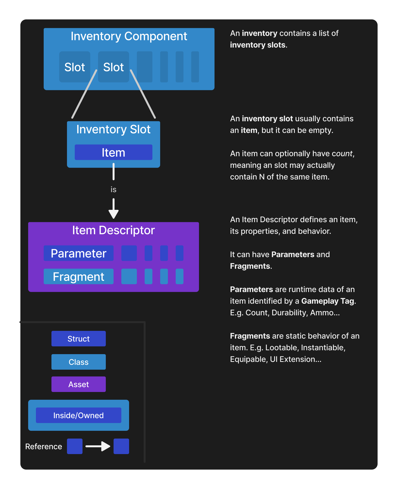
### Item Descriptor
`UIEItemDescriptor` -- <span style="color:#ba6ed8">Data Asset</span>

Item descriptors define an item statically, as an inmutable asset.
Items are made modular using [Fragments](#item-fragment) to reuse logic, and [Parameters](#item-parameter) for runtime data.

The two most defining elements of a descriptor are *Fragments* and *Parameters*:
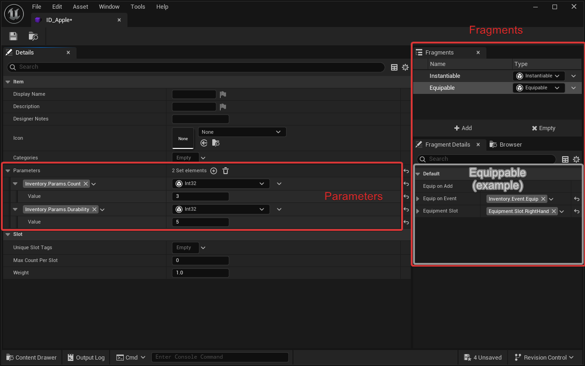
### Item Fragment
`UIEItemFragment` -- <span style="color:#ba6ed8">UObject</span> -- Inside a Descriptor

An Item Descriptor can have **one or more *Fragments*** that define the capabilities of the item.
Usually you want one unique fragment per item descriptor (*e.g An Item can only have one "Equippable" fragment*), but multiple of the same are allowed too (*e.g you may show two widgets when an item is equipped*).

**Item Fragments are** blueprintable and can be **scripted** both **in C++ and blueprints**.

The plugin does provide some fragments out of the box:
- **Instantiable**: Can this item be "physically" in the world? How should it look?
- **UIExtension**: *(Inside UIExtension integration plugin)* Should the Item show in UI, where and how?

Examples of fragment you can implement:
- **Equippable**: The item can be equipped. Which hand? Is it a weapon? Does it have ammo?
- **Spawnable**: The item can spawn randomly in the world. How should it do it? How many times?

If you are working with GAS, fragments can do things like grant abilities when the item is added or on events, remove them when the item is removed, apply effects, etc.
See [GAS Integration]()

> [!TIP]- You can add a display names and icons to item fragments for better readability
> 1. 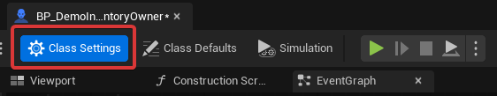
> 2. 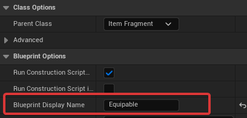
### Item Parameter
`FIEItemParameter` -- <span style="color:#6e72d8">Struct</span> -- <span style="color:yellow">Replicates</span> -- Inside a Descriptor or an Item

Parameters are runtime data bound to an item instance (`FIEItem`) and identified by a gameplay tag. This data is usually in the form of structs, or literals like integers, floats or bools.
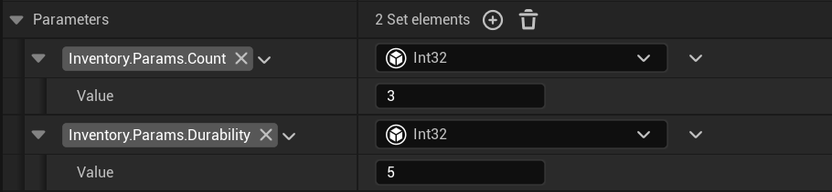

> [!IMPORTANT] **Overrides**
> If a parameter is modified on an `FIEItem`, it **overrides** the default value in its `UIEItemDescriptor`.
### Item
`FIEItem` -- <span style="color:#6e72d8">Struct</span> -- <span style="color:yellow">Replicates</span>

When we work with items we usually refer to item instances as items (`FIEItem`).

Unlike other inventory systems, **items are not uobjects**:
- They can be read, written, copied or stored like any other struct. Without special functions to do so, or complex implications in their logic.
- **Items** are considerably **cheaper, faster and lighter** (in memory) than other systems based on objects. Not only because they are structs, but also because they rely on static uobjects and reduce the data they hold only to what needs changing in runtime.
As a result you can have thousands, or tens of thousands of item instances simultaneously in the game without too much of a problem.
### Inventory Component
`UIEInventoryComponent` -- <span style="color:#6eccd8">Actor Component</span> -- <span style="color:yellow">Replicates</span>

A component that holds many items in order. Can have custom behavior.
Inventories hold items through Inventory Slots.
#### Settings
The tooltips of the inventory have detailed tooltips that explain their purpose, but here are some:
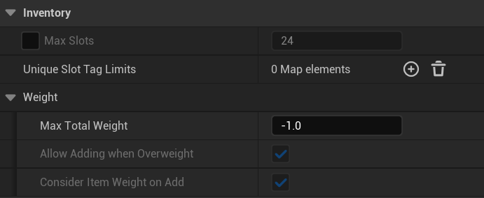
1. **Max Slots**: Maximum number of simultaneous slots allowed
2. **Unique Slot Tag Limits**: gameplay Tags that limit items allowed by their tags
3. **Max Total Weight**: Total weight allowed considering the weight of all items in the inventory

> [!Tip]
> Inventories themselves can be inherited from both in C++ and blueprints to create custom behavior.

#### Replication
* **Clients** are **Read-Only**. They receive synchronized updates via the `OnSlotsChanged` delegate.
* All modifications (adding, removing, moving items) must be performed on the **Server**.
  > [!Tip] Requests to modify from clients can be sent using RPCs by overriding the Inventory or from the Actor.
* **Component Replication:** The replication of the component is tied to the replication of its owner actor (e.g., an inventory on a Controller will not be available on all clients).

### Inventory Slot
`UIEInventorySlot` -- <span style="color:#6eccd8">UObject</span> -- Inside an Inventory

Represents occupied space inside an inventory. Usually contains an item, but may be empty.

---

## 2. Usage

### Inventories
#### Adding Items
Adding Items to an inventory will try to find space for them in existing slots and place them there. 

If there is not enough space for a certain Item, that is considered "**Excess**" and returned.


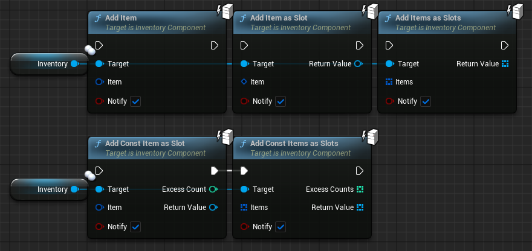



```cpp
// Add one item
Inventory->AddItem(Item, Excess);
// Add multiple items
Inventory->AddItems(Items, Excess);
```


### Items
#### Descriptors
##### Understanding the Editor
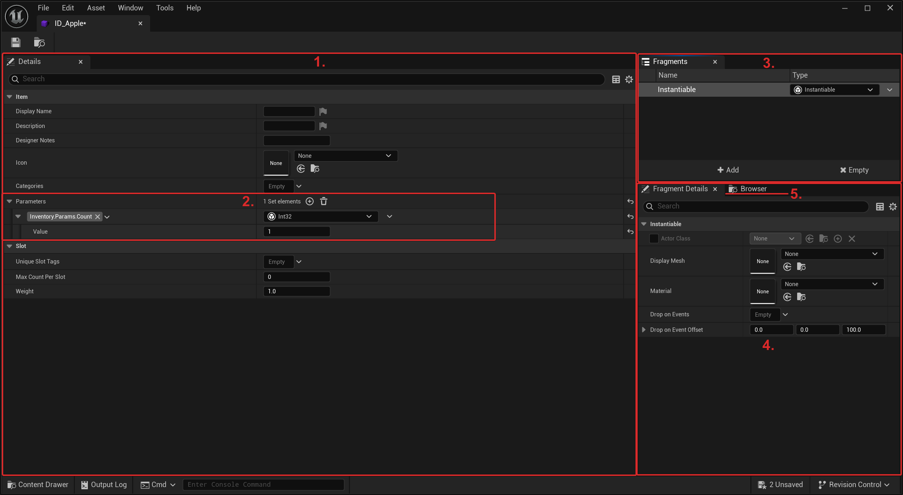
1. **Details**: Contains all item properties like Display Name or Description, and can control some of its behavior.
2. **Parameters**: Where you edit all **default** [parameters](#item-parameter) of the item
3. **Fragment List**: Shows all [fragments](#item-fragment) in the item and allows removing them or adding new ones.
4. **Fragment Details**: Where you edit all properties of the selected [fragment](#item-fragment)
5. **Browser**: Where you can quickly navigate across many Inventory related assets for convenience.
##### Creating items
Creating new items is simple. We create an Item Definition of it and assign fragments and parameters to our liking.

1. Create an Item Descriptor in the Asset Browser
   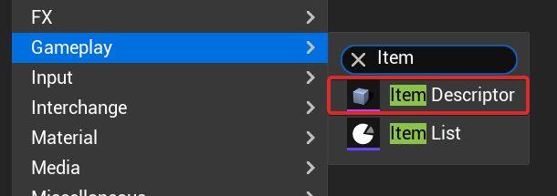
2. Edit its properties like Name or Weight, and add [fragments](#item-fragment) and [parameters](#item-parameter) accordingly.

#### Fragments
##### Creating Fragment Types
To create custom behavior in items, and to reuse functionality across different items, we can create an Item Fragment.

Fragments must inherit `UIEItemFragment`.


1. Create a blueprint class inheriting **Item Fragment**
    
2. Create variables to your liking and expose them to see them when adding the fragment to items.
   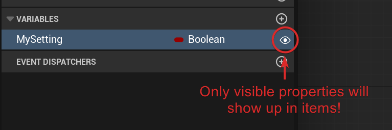
   > [!Tip] You can use variable categories too.
3. Often fragments provide logic to items, we can override functions to do this.
   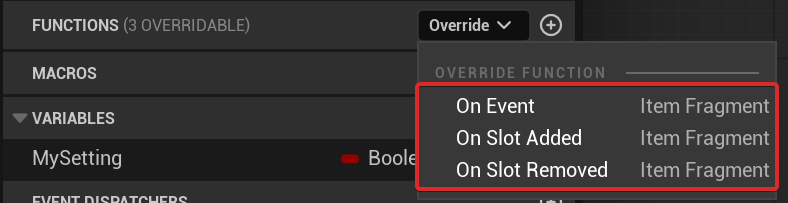
   



```cpp
#include <IEItemDescriptor.h>

UCLASS(Meta = (DisplayName = "My Fragment"))
class UItemFragment_MyFragment : public UIEItemFragment
{
	GENERATED_BODY()

public:
	// Property exposed to item descriptors:
	UPROPERTY(EditAnywhere, Category = WidgetExtension)
	FGameplayTag Tag;

	// Optional functions to provide logic to an item inside an inventory slot:
	void OnSlotAdded(UIEInventorySlot* Slot) const override;
	void OnSlotRemoved(UIEInventorySlot* Slot) const override;
	void OnEvent(FGameplayTag EventTag, const struct FInstancedStruct& EventData, const TArray<UIEInventorySlot*>& Slots) const override;
};
```


#### Parameters
##### Creating Parameter Types
While some parameters can be simple literals like ints, floats or bools, others can be complex structs with many variables.

Here is how to define them:


Item Parameters can be created in editor as **User Defined Structs**.
1. From the content browser, create an User Defined Struct 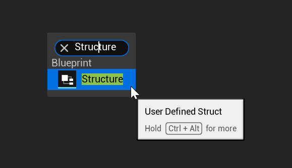
2. Add any fields you need to the struct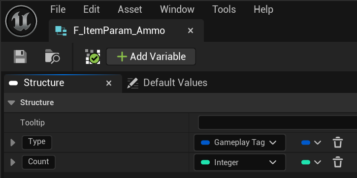



Parameter types can be defined in C++. It is recommended (but optional) to inherit from FIEItemParameter.
```cpp
#include <IEItemParameter.h>

// This parameter example represents ammunition, with a type and count
USTRUCT(BlueprintType, DisplayName = "Ammo")
struct FItemParam_Ammo : public FIEItemParameter
{
    GENERATED_BODY()

	UPROPERTY(SaveGame, EditAnywhere, BlueprintReadWrite, Category = Parameter)
    FGameplayTag Type;

    UPROPERTY(SaveGame, EditAnywhere, BlueprintReadWrite, Category = Parameter)
    int32 Count = 20;
};
```


> [!Tip]
> Items can be nested inside parameters, essentially being "contained" inside.
> 
> 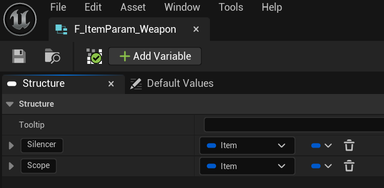
> 
> 
> ```cpp
> USTRUCT(BlueprintType, DisplayName = "Weapon")
>struct FItemParam_Weapon : public FIEItemParameter
>{
>    GENERATED_BODY()
>
>    UPROPERTY(SaveGame, EditAnywhere, BlueprintReadWrite, Category = Parameter)
>    FIEItem Silencer;
>
>    UPROPERTY(SaveGame, EditAnywhere, BlueprintReadWrite, Category = Parameter)
>    FIEItem Scope;
>};
> ```
> 

> [!Note]
> Binding tags to specific parameter types, making editing much faster, will be supported in the future
##### Assigning defaults
By **default parameters** we refer to parameters statically defined in the **Item Descriptor**.<br>**They will not change in runtime.**

You can simply open the item descriptor and edit them at your will.
Each parameter has a tag that identifies it and the data type. For example a parameter with tag `Inventory.Param.Count` expects an **Integer** parameter type.
##### Assigning overrides
When we want to add or modify a parameter in an instance of an item (`FIEItem`), we refer to it as overriding a parameter.

- If the item **has a default parameter** with the same tag: Overriding will hide the default value and when getting it we will return the new value instead.
- If the item **doesn't have a default parameter** with the same tag: Overriding will set the value and return it when getting it.
##### Deleting overrides
When we delete an override, we simply do the opposite:
- If there is a default value: Getting the parameter will get the default value.
- If there is no default value: Getting the parameter will fail.

#### Dropping

Items can be dropped into the world *if they contain an "**Instantiable**" fragment*.

This fragment defines which actor class to use (though a default one from settings can be used), but this actor class must implement **InstantiatedItem** interface.


##### Dropping from an Inventory
Items can be dropped from an inventory, optionally removing them from the inventory, and spawning an item actor as requested.

We use the inventory slot of the item for this.

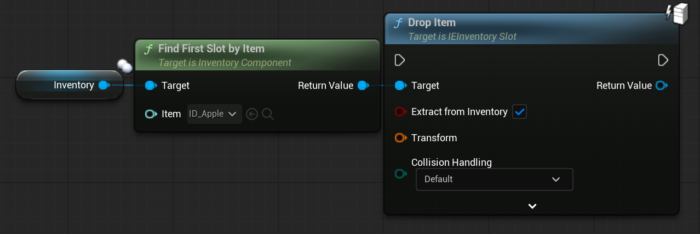



```cpp
// Get the slot we will drop
UIEInventorySlot* Slot = Inventory->FindFirstSlotByItem(ItemDescriptor);
// If it is valid
Slot->DropItem(...);
```


##### Dropping manually
Items can also be spawned without an inventory, only spawning an item actor as requested, and not affecting the source item (so you can do with it what you wish).


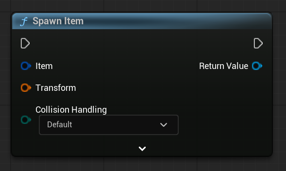



```cpp
Item.Spawn(...);
```

