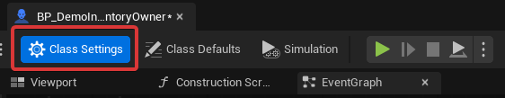
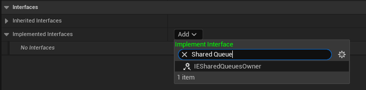
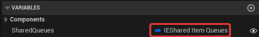
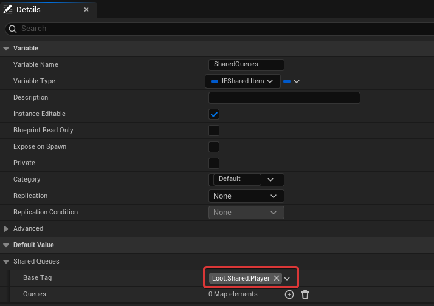
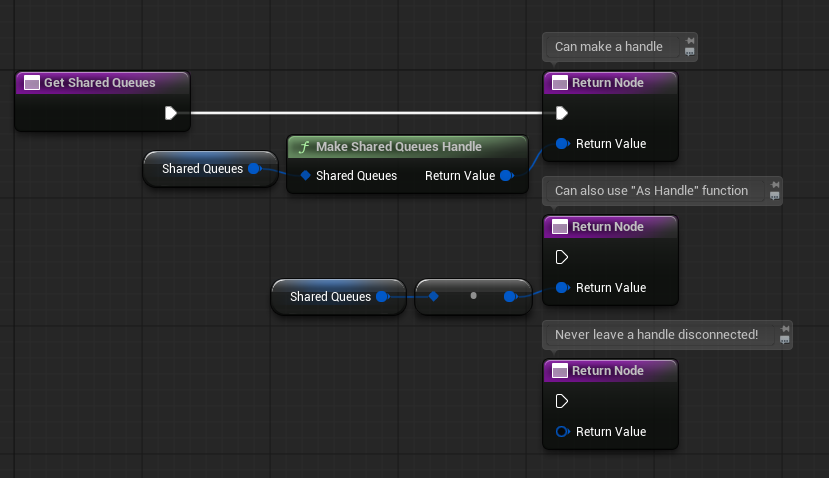

**Looting** provides functionality to select items randomly from "item queues".

> [!Important]
> If you have not already, it is recommended to read about  [Inventory]()  before this page.

## 1. Architecture
### Item Queue
`FIEItemQueue` -- Struct

**Item Queues** represent a random queue of items you can pop to get random items.
Imagine a deck of cards where cards can be taken out one by one.

Each item in a queue can have **weight**. *E.g. If an item has weight 5 it is "in the queue 5 times".*
As an example in an item queue with 'A(5) B(1) C(2)' we have 8 *cards*. 5 are A, 1 is B and 2 are C.
5, 1 and 2 are the weights.
#### Pop
Popping a queue is when we take an item out of it.
#### Refill
Refill means we reset the queue to its full state, where all items are available with their full weights. 

Some randomization modes do refill automatically when the queue gets emptied, but the user can also refill at will any queue.
#### Randomization
The randomization of a queue defines how the items are picked.
It has 3 different settings:
- Ignore item weights when calculating their probability in the queue:
	- **With weights** (default): Queue A(5), B(2) and C(1) has probabilities of A(33%), B(33%) and C(33%).
	- **Ignore weights**: Queue A(5), B(2) and C(1) has probabilities of A(62,5%), B(25%) and C(12,5%).
 - Should the queue NOT refill when emptied and be finite?
	 - **Infinite** (default): When the queue gets emptied, it will refill on its own.
	 - **Finite**: When the queue gets emptied it wont refill on its own.
	   Queues can always be refilled manually!
- Should items be kept when popping from a queue?
	- **Remove popped** (default): Reduces weight by 1 until the queue is empty, items don't repeat until refilled.
	- **Keep popped**: Doesn't reduce weight, items can repeat and the queue is infinite.

### Shared Item Queue
**Shared Item Queues** are simply **Item Queues referenced by a gameplay tag** and owned by an uobject.
These owners can be, for example, level, game instance, player, etc, where their lifetimes define the lifetime of their queues.

Lets see an example:
*Imagine we have thousands of loot crates in our game.*
We can have them all use their own item queue, but we are more likely to share loot between them. With a shared queue the looting of all those crates is connected, and we can balance it in seconds (and without modifying levels).

### Shared Item Queue Owners
`IIESharedQueuesOwner` -- Object Interface

**Shared Item Queues** are always owned by a **Shared Item Queue Owner**. Each owner can have many.

Owners are **registered under a base tag**, that all its shared tasks must use.

You can create your own owners, for players or other objects.
However, some owners are provided out-of-the-box by the plugin:
- **Level** shared queues: Their state lasts as long as the current level does.
  They use the **base tag** `Loot.Shared.Level`.
  Queues inside must be sub-tags of `Level`, like `Loot.Shared.Level.Mobs`
- **Game** shared queues: Their state lasts as long as the entire game does.
  They use the **base tag** `Loot.Shared.Game`.
  Queues inside must be sub-tags of `Game`, like `Loot.Shared.Game.Mobs`

#### How are Owners found
You may have though already, if there are two players with shared queues as owners, how do we know which one to get queues from for popping items?

This is where **ItemQueueContext** comes in.
ItemQueueContext is used to be aware of the context in which we are running loot logic.

It gets passed a **context object** from which it will try to find owners **if they implement the SharedQueuesOwner interface**:
- Game owner
- Level owner
- Context
- Actor of Context (if it is a Component)
- Controller of Context (if it is an Actor or Component)
- PlayerState of Context (if it is an Actor or Component)
### Item Queue Contexts
`FIEItemQueueContext` -- Struct

An Item Queue Context is an struct that allows the execution of queues (Refill and Pop), feeding the context surrounding it. When created it gathers all shared queue owners available and makes them accessible for execution.

Contexts built from different objects can result in different available shared queues.
For example, if a player is a shared queue owner and opening a loot crate pops from his shared queues, other players would be **unaffected** by this and still have their queues intact.

This is why, since context matters, all relevant queue operations are done from a context.

You can reuse contexts too for many queues as long as the context is still relevant too.

Therefore:
- Contexts **shouldn't be stored**, but instead created in-situ for execution. (Or you run the risk of having out-of-date context)
- Context **can be reused** for many queues as long as the context object is the same.
## 2. Usage
### Pop and Refill queues
To operate with queues, we first create an **Item Queue Context**.
This is so that we know where to find shared queues from. A context built from two different players for example can have different shared queues.

### Implementing shared queue owners
1. Go to Class Settings in the object you want to make an owner. 
   
2. Add the SharedQueuesOwner interface 
   
3. Add a SharedItemQueues variable to the class.
   "**SharedItemQueues**", not SharedItemQueuesHandle!!
   
   
4. Set a BaseTag in this variable or it wont be detected as an owner. 
   
5. Implement **GetSharedQueues** and pass the SharedItemQueues variable you have created before using "Make a Shared Queues Handle" or "As Handle": 