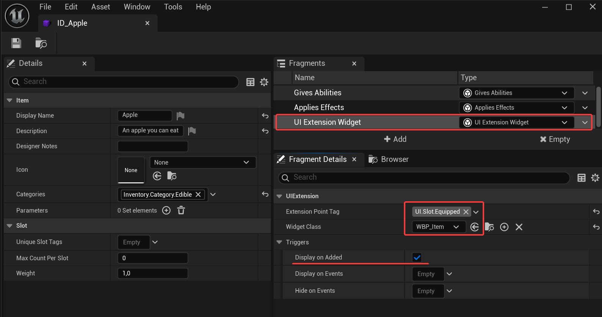

[UI Extension](https://x157.github.io/UE5/UIExtension/) is a plugin provided by Epic Games in Lyra.

While **Inventory Extension** does not directly depend on Lyra or UI Extension to keep it lightweight and portable, we understand its common for items to need displaying widgets in projects with this plugin.
## Usage
### Installing the integration plugin
This integration is an small, additional plugin available inside the **"Extras"** folder of the Inventory Extension plugin.

To install it:
- Go to the path of your **InventoryExtension** plugin, then "**Extras**".
- Copy **InventoryExtensionUIExtension** folder into your plugins folder.
- **You are done**, simply restart/open the editor. You may need to enable the plugin in the editor.

### Displaying widgets from Items
You can extend UI points using the **UI Extension Widget** fragment:
